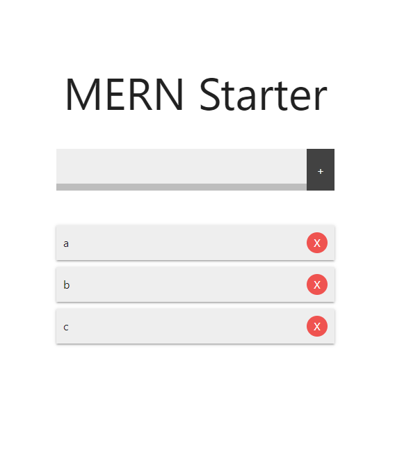

# MERN Starter

> CRUD application in React over an Express/MongoDB back end

### Overview

  

App renders form and list of cards, each displaying the name of a corresponding <code>item</code> in the database.

When the app renders, it uses <code>axios</code> to send a <code>GET</code> request to the database, and populate the list of items.

Submitting a string value to the form sends a <code>POST</code> request to the database and (on success) creates a new <code>item</code> with a unique id property and the custom <code>name</code> property.

Each item card is rendered with a delete button to handle <code>DELETE</code> requests, passing in the item's id. 

### Concepts

* Express
  * connect to MongoDB
  * use Mongoose ORM to create Schema and Models
  * handle request errors
  * define routes
    * GET
    * POST
    * PUT
    * DELETE
  * send correct HTTP response status codes
  * <code>request</code> object properties and methods
  * <code>responst</code> object properties and methods

* React
  * Context API - <code>Provider</code> & <code>Consumer</code> components
  * class-based components
  * functional components
  * component state
  * props
  * lifecycle methods - <code>ComponentDidMount()</code> & <code>ComponentDidUpdate()</code>
  * form handling
  * conditional rendering

### Author

[Brian Beal](https://github.com/brianwbeal)

> [linkedin](https://www.linkedin.com/in/brianwbeal/)

### Version

1.0.0

